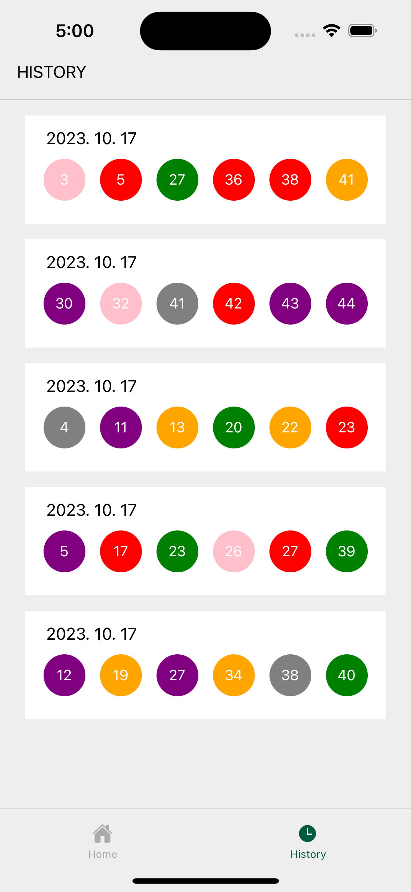

## React Native - 로또 번호 생성기

6개의 로또 번호를 랜덤으로 추출해주는 어플입니다.  
히스토리 페이지에서 추츨한 로또 번호 내역을 확인할 수 있습니다.

### 작업내용

- UI 컴포넌트 화면 생성
- 로또 번호 생성 로직 작성
- 생성된 번호를 redux에 저장
- 히스토리 페이지에 로또번호 히스토리 표출
- 애니메이션 효과 추가

### 기술스택

React Native (Expo), JavaScript, Redux
